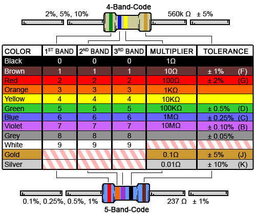

# Projetos de Microcontroladores  
👋 Bem-vindo ao meu repositório!  
Aqui você encontrará projetos e materiais relacionados a microcontroladores, desenvolvidos para aprendizado e prática.  

## 📖 Manual do ESP32  
Para facilitar os estudos, segue o link do manual oficial do ESP32:  
[Manual do ESP utilizado nos projetos](https://github.com/mwbr7/microcontroladores-projetos/blob/main/arquivos-fundamentais/ESP32%20Basic%20Starter%20Kit%20Tutorial.pdf)  

## 🖼️ Padrão Internacional de Cores nos Resistores  
  

## 🚀 Projetos  
- Projeto 1: Semáforo com ESP32  
- Projeto 2: Automação residencial básica  
- Projeto 3: Controle de acesso com RFID  
