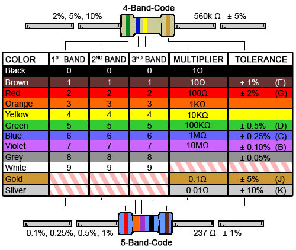

# Projetos de Microcontroladores  
👋 Bem-vindo ao meu repositório!  
Aqui você encontrará projetos e materiais relacionados a microcontroladores, desenvolvidos para aprendizado e prática.

## 🚀 Projetos  
- Projeto 1: [Controle de acesso utilizando ESP e RFID](https://github.com/mwbr7/microcontroladores-projetos/tree/main/projeto-controle-de-acesso)  
- Projeto 2: [Monitoramento de Piscina utilizando ESP32-CAM e OV2640](https://github.com/mwbr7/microcontroladores-projetos/tree/main/projeto-monitoramento-de-piscina)  
- Projeto 3:  

## 📖 Manual do ESP32  
Para facilitar os estudos, segue o link do manual do ESP32 utilizado nos projetos:  
[Manual do ESP](https://github.com/mwbr7/microcontroladores-projetos/blob/main/assets/ESP32-Manual.pdf)  

## Ω Padrão Internacional de Cores dos Resistores  
  
